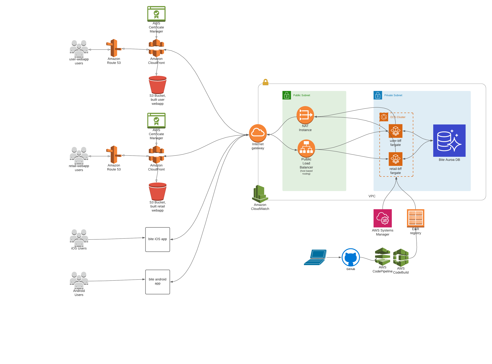

# Overview of features

This project is a social food app

Customers can:
 - See restaurants and their menus
 - Order and pay for food 
 - Send gifts of food
 - Redeem gits of food
 - Update their acc information
 - Sign in & sign up

Restaurants can:
 - Confirm pending orders
 - Set storewide coupons
 - Make menus via a UI
 - Set open times

# State of project:

MVP completed, needs a bit of cleaning up though. All AWS is teared down and old commits squashed for sensitive information.

[All code can be found here](https://github.com/isaac-patterson?tab=repositories&q=bite&type=&language=&sort=)

Components

 - Retail webapp: pretty polished

 - BFFs: user-bff needs some extracting into microservices for a better architecture, needs more testing & monitoring etc

 - iOS App: Done by a contractor, good luck with this

 - Android App: Barely started 

 - Infra: Cloudformation needs multi environment support to be added via mappings

# AWS Architecture

Theres also cognito auth and aws sns slack alerts written in cloudformation but lucidchart free trial isnt quite big enough

# Software for local setup

For setup of each component go to their repos

Prereqs for whole project:
 * MySQL 8+
 * MySQL workbench
 * Node.js
 * React
 * Visual studio with .net core 5
 * Docker
 * AWS CLI
 * Amplify CLI
 * A jetpack compose compatible version of Android Studio
 * A swiftui compatible version of XCode